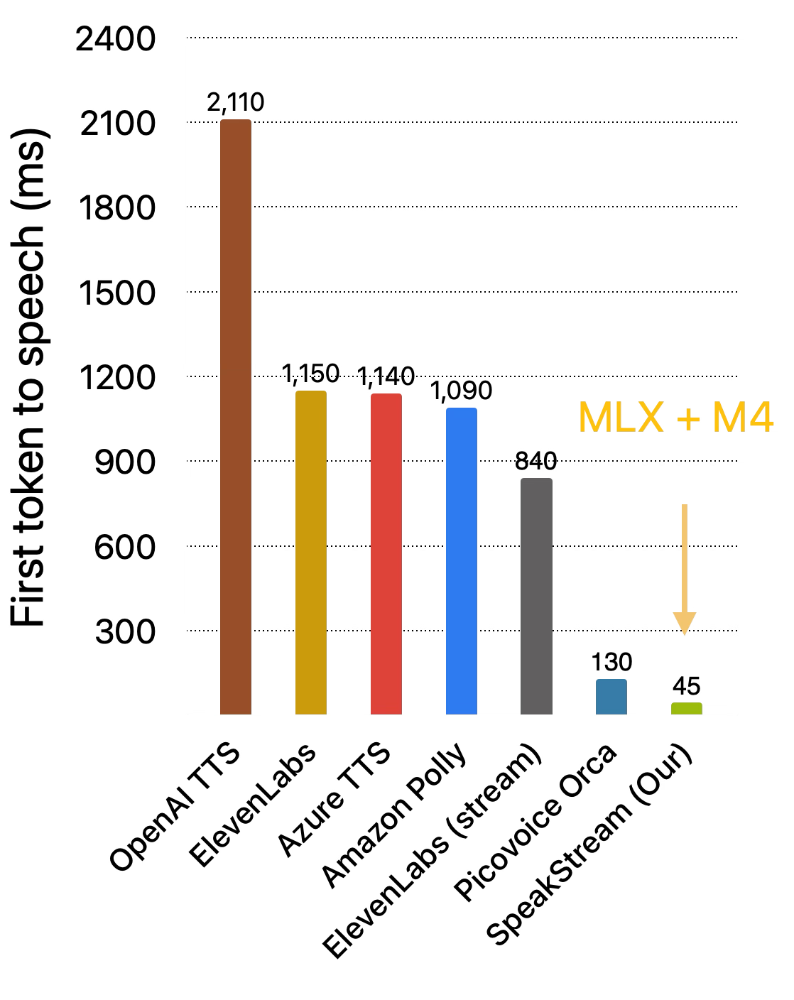

<div align="center">
  <h1>SpeakStream: Streaming Text-to-Speech with Interleaved Data</h1>

  [](https://arxiv.org/pdf/2505.19206)
  [](https://openreview.net/forum?id=3x0GD1yvIS)
</div>

In this work, we present a streaming TTS (SpeakStream) that can generate audio incrementally from streaming text using a decoder-only architecture. The model is trained using next-step prediction loss on force-aligned, interleaved text-speech data. During inference SpeakStream generates speech incrementally while absorbing streaming text, making it suitable for cascaded conversational AI agents where an LLM streams text to a TTS system. Our experiments show that SpeakStream matches non-streaming TTS quality while enabling streaming capabilities.

<p align="center">
  <a href="path/to/file.pdf">
    
  </a>
  <a href="path/to/file.pdf">
    
  </a>
</p>

## Generated Samples

The repository provides examples of the generated speech for models trained on [LJSpeech dataset](https://keithito.com/LJ-Speech-Dataset/).

## License

- Repository is released under [LICENSE](LICENSE). 
- All generated speech samples are licensed under [Creative Commons Attribution-Noncommercial-Nonderivatives 4.0 International License](https://creativecommons.org/licenses/by-nc-nd/4.0/)

## Citations

```
@article{bai2025speakstream,
  title={SpeakStream: Streaming Text-to-Speech with Interleaved Data},
  author={Bai, He and Gu, Zijin and Likhomanenko, Tatiana and Jaitly, Navdeep},
  journal={arXiv preprint arXiv:2505.19206},
  year={2025}
}
```
